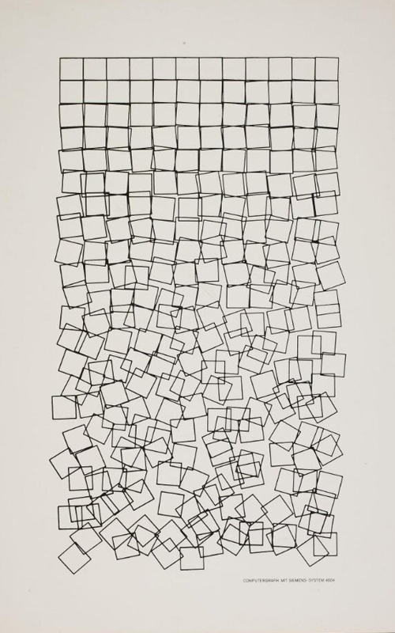

# gen-schotter

Lately, I've been looking for an excuse to get involved in the creative coding world, so I thought it would be interesting to recreate in p5.js some artworks from the pioneers of computer-generated art!

My first attempt was Georg Nees' 'Schotter', a composition featuring a grid of squares that are slightly rotated and displaced, creating a mesmerizing sense of randomness while balancing order and chaos:

 
I started with —Grasshopper Python— and eventually transitioned to p5.js, you can find the output of the exercise here.
